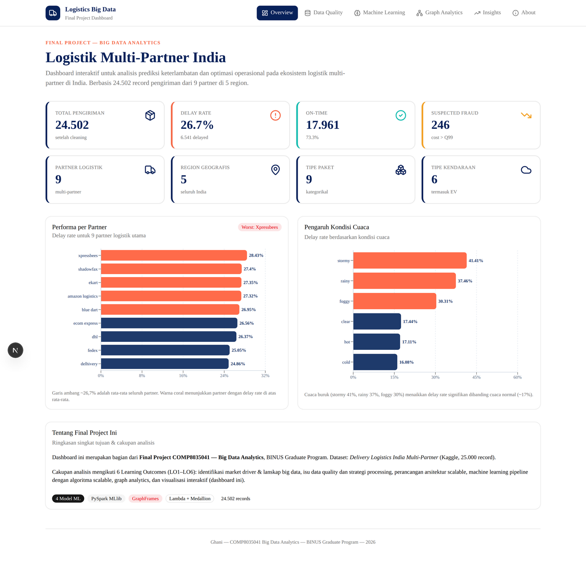
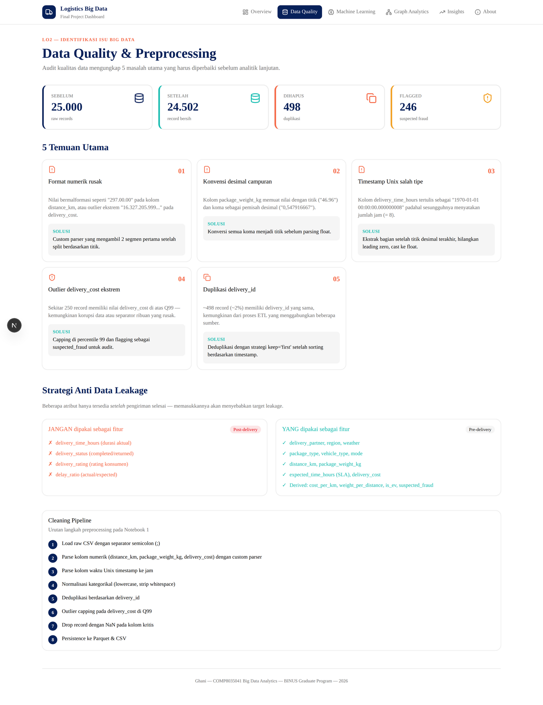
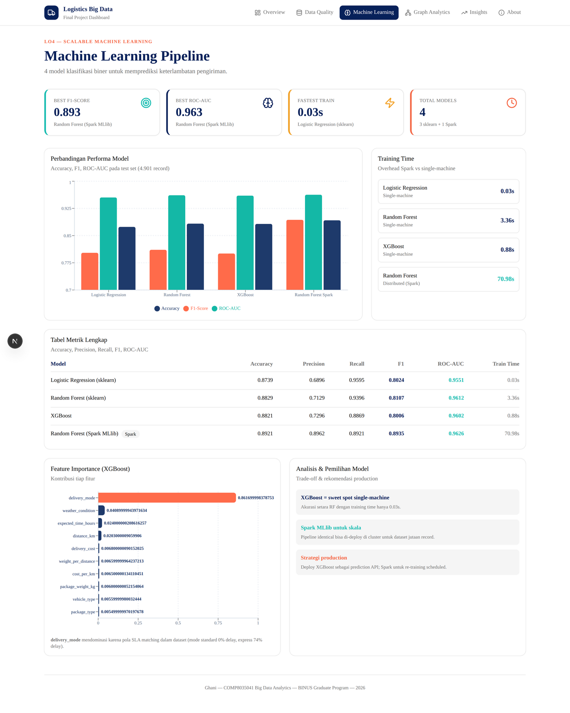
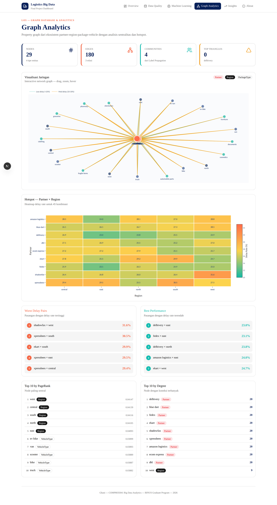
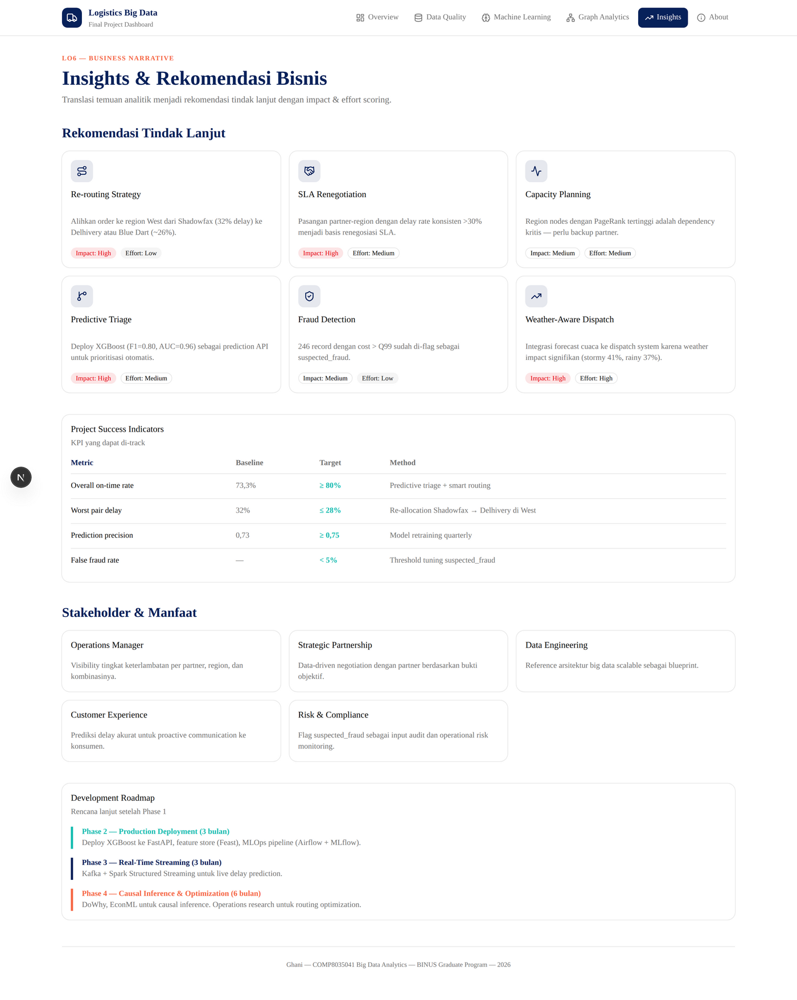
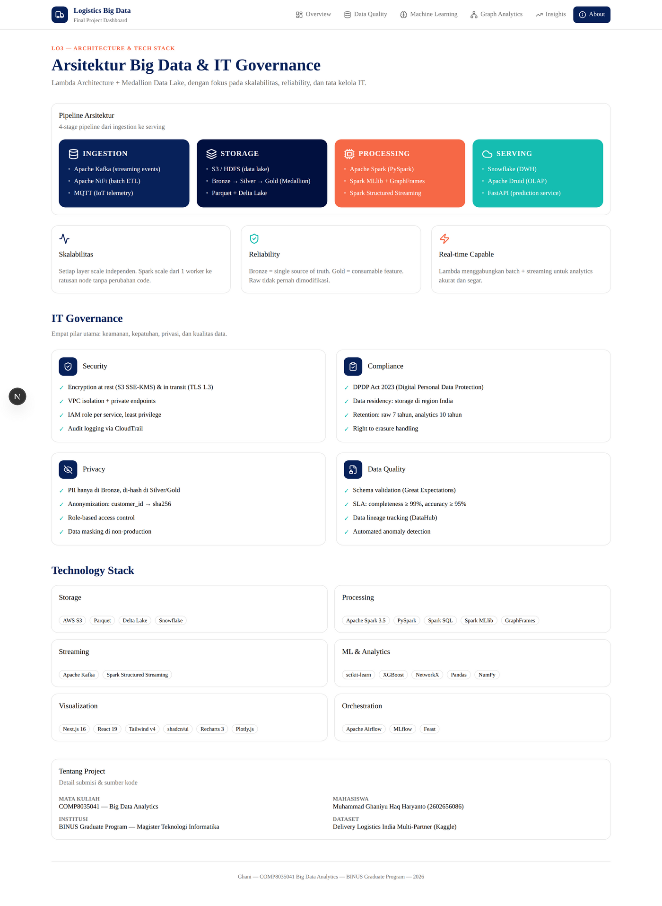

# Logistics Big Data Dashboard

Dashboard interaktif untuk **Final Project COMP8035041 — Big Data Analytics**, BINUS Graduate Program (Magister Teknologi Informatika).

Studi kasus: prediksi keterlambatan & optimasi operasional pada industri logistik multi-partner di India, berbasis dataset **Delivery Logistics India Multi-Partner** (Kaggle, 25.000 record).

---

## Screenshots

### Overview — Ringkasan eksekutif



Top stats (total pengiriman, delay rate, on-time, suspected fraud) plus dua bar chart utama untuk performa per partner dan pengaruh kondisi cuaca. Threshold coloring otomatis menandai partner di atas/bawah rata-rata.

### Data Quality — 5 temuan utama



Audit kualitas data dari 25.000 record raw → 24.502 record bersih, dengan strategi anti data leakage (kolom mana yang boleh dan tidak boleh dipakai sebagai fitur ML).

### Machine Learning — Perbandingan 4 model



Perbandingan Logistic Regression, Random Forest (sklearn), XGBoost, dan Random Forest (Spark MLlib). Spark MLlib menang di F1 (0,894) dan ROC-AUC (0,963), tapi XGBoost adalah sweet spot dengan akurasi setara dan training time **75× lebih cepat**.

### Graph Analytics — Network + Heatmap



Property graph 29 nodes (9 Partner, 5 Region, 9 PackageType, 6 VehicleType) dengan 180 edges. Heatmap delay rate untuk 45 kombinasi Partner × Region langsung mengungkap hotspot: **Shadowfax × West (31,6%)** sebagai yang terburuk, **Delhivery × East (23,0%)** sebagai yang terbaik.

### Insights — Rekomendasi tindak lanjut



6 rekomendasi tindak lanjut dengan impact/effort scoring, project success indicators (KPI dengan baseline & target), dan development roadmap 4-phase.

### About — Arsitektur & IT Governance



4-layer architecture (Ingestion → Storage → Processing → Serving), prinsip skalabilitas/reliability/real-time, dan 4 pilar IT Governance (Security, Compliance, Privacy, Data Quality).

---

## Tech Stack

| Kategori | Teknologi |
|---|---|
| Framework | Next.js 16.2 (App Router) + React 19 |
| Styling | Tailwind CSS v4 + shadcn/ui (style: radix-nova) |
| Charts | Recharts 3 (bar/grouped) + Plotly.js (heatmap, network graph) |
| Icons | lucide-react |
| Runtime | Bun (atau Node.js) |
| Lang | TypeScript (strict) |

Data dihasilkan dari 3 Jupyter notebook PySpark/sklearn/NetworkX di repo `assignment2`, lalu di-export ke 8 file JSON di folder `data/`.

---

## Getting Started

### Install

```bash
bun install
# atau
npm install
```

### Run dev

```bash
bun dev
# buka http://localhost:3000
```

### Build production

```bash
bun run build
bun start
```

---

## Struktur Project

```
final-project-dashboard/
├── data/                       # 8 file JSON hasil notebook
│   ├── overview.json
│   ├── partners.json
│   ├── weather.json
│   ├── heatmap.json
│   ├── ml_results.json
│   ├── modes_vehicles_packages.json
│   ├── feature_importance.json
│   └── graph.json
├── src/
│   ├── app/
│   │   ├── page.tsx            # Overview
│   │   ├── data-quality/       # LO2 — Data Quality
│   │   ├── ml/                 # LO4 — Machine Learning
│   │   ├── graph/              # LO5 — Graph Analytics
│   │   ├── insights/           # LO6 — Business Insights
│   │   ├── about/              # LO3 — Architecture & Governance
│   │   └── api/                # 8 API routes (force-static)
│   ├── components/
│   │   ├── charts/             # HorizontalBar, GroupedBar, Heatmap, NetworkGraph
│   │   ├── ui/                 # shadcn components
│   │   ├── navbar.tsx
│   │   └── page-header.tsx
│   └── lib/
│       ├── types.ts            # 11 TypeScript interfaces
│       ├── utils.ts            # cn(), formatNumber(), formatPct()
│       └── server-data.ts      # readData() helper
└── public/screenshots/         # Dashboard screenshots untuk README
```

---

## Pemetaan ke Learning Outcomes

| LO | Topik | Halaman |
|---|---|---|
| LO1 | Market & business drivers logistik India | (di laporan) |
| LO2 | Big data issues + data quality | `/data-quality` |
| LO3 | Arsitektur scalable + IT governance | `/about` |
| LO4 | ML dengan algoritma scalable (Spark MLlib) | `/ml` |
| LO5 | Graph database & analytics | `/graph` |
| LO6 | Visualisasi interaktif & business insights | seluruh dashboard + `/insights` |

---

## Author

**Muhammad Ghaniyu Haq Haryanto** — NIM 2602656086
BINUS Graduate Program, Magister Teknologi Informatika, 2026
Mata Kuliah: COMP8035041 — Big Data Analytics

---

## License

Project akademik untuk keperluan submisi mata kuliah. Dataset bersumber dari Kaggle ([Delivery Logistics India Multi-Partner](https://www.kaggle.com/datasets/kundanbedmutha/delivery-logistics-dataset-india-multi-partner)) di bawah lisensi masing-masing publisher.
